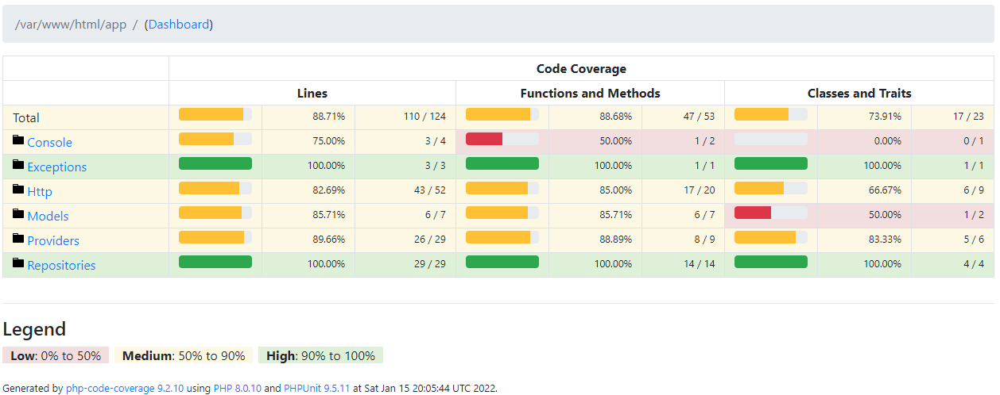

# Posterr
## Gettings Started
It's need to install in your computer:
`Docker: 18.06.0+`
`Docker-compose: 1.27.0+`

Execute this commands to start the application:
```bash
// Create the .env file
cp .env.example .env
// Start all containers docker
docker-compose up -d
// Enter in container
make bash
// Generate the key
php artisan key:generate
// It's everything!
// You can access the api in: http://localhost:8040/
```
## Framework
- [Laravel](https://laravel.com/)
## Database
- MySQL 8.0

### Migrations
```bash
// Drop/Create migrations with seeds
php artisan migrate:fresh --seed
// Install database without datas
php artisan migrate:fresh
```

## API Docs
### Get all posts
**Request**
```bash
curl --location --request GET 'localhost:8040/api/v1/posts'
```
**Status**
```text
HTTP 200
```
**Response**
```json
{ "current_page": 1, "data": [ { "id": 1, "content": "asdasd", "user_id": 1, "created_at": "2022-01-15T18:41:01.000000Z", "updated_at": "2022-01-15T18:41:01.000000Z", "reposts": [], "quote_posts": [] }, { "id": 2, "content": "asdasd", "user_id": 1, "created_at": "2022-01-15T18:41:02.000000Z", "updated_at": "2022-01-15T18:41:02.000000Z", "reposts": [], "quote_posts": [] }, { "id": 3, "content": "asdasd", "user_id": 1, "created_at": "2022-01-15T18:41:03.000000Z", "updated_at": "2022-01-15T18:41:03.000000Z", "reposts": [], "quote_posts": [] }, { "id": 4, "content": "asdasd", "user_id": 1, "created_at": "2022-01-15T18:41:04.000000Z", "updated_at": "2022-01-15T18:41:04.000000Z", "reposts": [], "quote_posts": [] }, { "id": 5, "content": "asdasd", "user_id": 1, "created_at": "2022-01-15T18:41:04.000000Z", "updated_at": "2022-01-15T18:41:04.000000Z", "reposts": [], "quote_posts": [] }, { "id": 6, "content": "asdasd", "user_id": 1, "created_at": "2022-01-15T18:41:05.000000Z", "updated_at": "2022-01-15T18:41:05.000000Z", "reposts": [], "quote_posts": [] } ], "first_page_url": "http://localhost:8040/api/v1/posts?page=1", "from": 1, "last_page": 1, "last_page_url": "http://localhost:8040/api/v1/posts?page=1", "links": [ { "url": null, "label": "&laquo; Previous", "active": false }, { "url": "http://localhost:8040/api/v1/posts?page=1", "label": "1", "active": true }, { "url": null, "label": "Next &raquo;", "active": false } ], "next_page_url": null, "path": "http://localhost:8040/api/v1/posts", "per_page": 15, "prev_page_url": null, "to": 6, "total": 6 }
```

### Get all posts following
**Request**
```bash
curl --location --request GET 'localhost:8040/api/v1/posts/following?user_id=6'
```
**Status**
```text
HTTP 200
```
**Response**
```json
{ "current_page": 1, "data": [ { "id": 1, "content": "asdasd", "user_id": 1, "created_at": "2022-01-15T18:41:01.000000Z", "updated_at": "2022-01-15T18:41:01.000000Z", "reposts": [], "quote_posts": [] }, { "id": 2, "content": "asdasd", "user_id": 1, "created_at": "2022-01-15T18:41:02.000000Z", "updated_at": "2022-01-15T18:41:02.000000Z", "reposts": [], "quote_posts": [] }, { "id": 3, "content": "asdasd", "user_id": 1, "created_at": "2022-01-15T18:41:03.000000Z", "updated_at": "2022-01-15T18:41:03.000000Z", "reposts": [], "quote_posts": [] }, { "id": 4, "content": "asdasd", "user_id": 1, "created_at": "2022-01-15T18:41:04.000000Z", "updated_at": "2022-01-15T18:41:04.000000Z", "reposts": [], "quote_posts": [] }, { "id": 5, "content": "asdasd", "user_id": 1, "created_at": "2022-01-15T18:41:04.000000Z", "updated_at": "2022-01-15T18:41:04.000000Z", "reposts": [], "quote_posts": [] }, { "id": 6, "content": "asdasd", "user_id": 1, "created_at": "2022-01-15T18:41:05.000000Z", "updated_at": "2022-01-15T18:41:05.000000Z", "reposts": [], "quote_posts": [] } ], "first_page_url": "http://localhost:8040/api/v1/posts?page=1", "from": 1, "last_page": 1, "last_page_url": "http://localhost:8040/api/v1/posts?page=1", "links": [ { "url": null, "label": "&laquo; Previous", "active": false }, { "url": "http://localhost:8040/api/v1/posts?page=1", "label": "1", "active": true }, { "url": null, "label": "Next &raquo;", "active": false } ], "next_page_url": null, "path": "http://localhost:8040/api/v1/posts", "per_page": 15, "prev_page_url": null, "to": 6, "total": 6 }
```

### Get profile
**Request**
```bash
curl --location --request GET 'localhost:8040/api/v1/users/brunoferreiras/profile'
```
**Status**
```text
HTTP 200
```
**Response**
```json
{ "username": "brunoferreiras", "date_joined": "Jan 15, 2022", "total_followers": 0, "total_following": 0, "total_posts": 6 }
```

### Create user
**Request**
```bash
curl --location --request POST 'localhost:8040/api/v1/users' \
--header 'Content-Type: application/json' \
--data-raw '{
    "name": "Bruno Ferreira",
    "username": "brunoferreiras"
}'
```
**Status**
```text
HTTP 201
```
**Response**
```json
{ "name": "Bruno Ferreira", "username": "brunoferreiras", "updated_at": "2022-01-15T19:58:31.000000Z", "created_at": "2022-01-15T19:58:31.000000Z", "id": 1 }
```

### Create Post
**Request**
```bash
curl --location --request POST 'localhost:8040/api/v1/posts' \
--header 'Content-Type: application/json' \
--data-raw '{
    "content": "any text",
    "user_id": 1
}'
```
**Status**
```text
HTTP 201
```
**Response**
```json
{ "content": "any text", "user_id": 1, "updated_at": "2022-01-15T19:59:07.000000Z", "created_at": "2022-01-15T19:59:07.000000Z", "id": 1 }
```

### Create Repost
**Request**
```bash
curl --location --request POST 'localhost:8040/api/v1/posts/1/repost' \
--header 'Content-Type: application/json' \
--data-raw '{
    "comment": "",
    "user_id": 1
}'
```
**Status**
```text
HTTP 201
```
**Response**
```json
{ "comment": null, "user_id": 1, "post_id": "1", "updated_at": "2022-01-15T19:59:47.000000Z", "created_at": "2022-01-15T19:59:47.000000Z", "id": 1 }
```

### Create Quote post
**Request**
```bash
curl --location --request POST 'localhost:8040/api/v1/posts/1/repost' \
--header 'Content-Type: application/json' \
--data-raw '{
    "comment": "any comment",
    "user_id": 1
}'
```
**Status**
```text
HTTP 201
```
**Response**
```json
{ "comment": "any comment", "user_id": 1, "post_id": "1", "updated_at": "2022-01-15T19:59:47.000000Z", "created_at": "2022-01-15T19:59:47.000000Z", "id": 1 }
```

### Follow
**Request**
```bash
curl --location --request POST 'localhost:8040/api/v1/users/brunoferreiras/follow' \
--header 'Content-Type: application/json' \
--data-raw '{
    "follower_id": 6,
    "following_id": 5
}'
```
**Status**
```text
HTTP 204
```
**Response**
```json
```

### Unfollow
**Request**
```bash
curl --location --request POST 'localhost:8040/api/v1/users/brunoferreiras/unfollow' \
--header 'Content-Type: application/json' \
--data-raw '{
    "follower_id": 1,
    "following_id": 2
}'
```
**Status**
```text
HTTP 204
```
**Response**
```json
```

## Code Coverage

Execute the tests:
```bash
// Outside container
make test
// Inner container
./vendor/bin/phpunit --testdox --verbose
```


# Planning

### Questions about implementation
1. What permission rules will need?
2. Can the user reply to the post itself?
3. Will the response have the same daily post-creation limit?

### Implement solution
1. Create a new column in the `posts` table called the `mentioned_id`, which will be the post that was mentioned.
2. Create a new tab on the front of the home page for this functionality.
3. In the post-creation route, a regex will be added to the content to identify a mention, if there is a mention, a search in the database will be performed to identify the post, and then add the post id in the `mentioned_id` field of the table `posts`.
4. A new route will be created with the paginated information that will return only as posts that have been mentioned.
5. In the post creation route, if a reply to the post does not respect the same limit of daily posts, an exception to this rule must be created for this situation in the authorization of the request. Otherwise, they executed the same.

# Critique
### Improvements
1. Optimize docker images (removing waits and installing packages in docker entrypoint)
2. Add more tests to fails situation
3. Install ElasticSearch to implement the search posts
4. Add cache (Redis) for most used routes (posts, etc)
5. Add custom logs during the executions on routes
6. Add oauth2/JWT to better identify users.
7. Analyze what slow executing queries and optimize them.

### Scalling
1. Use some database in cloud (Google Cloud SQL, for example)
2. Install Kubernetes to manager the services
3. Add observability with Istio
4. Use Elastic Search for logs
5. Use some cache service in cloud
